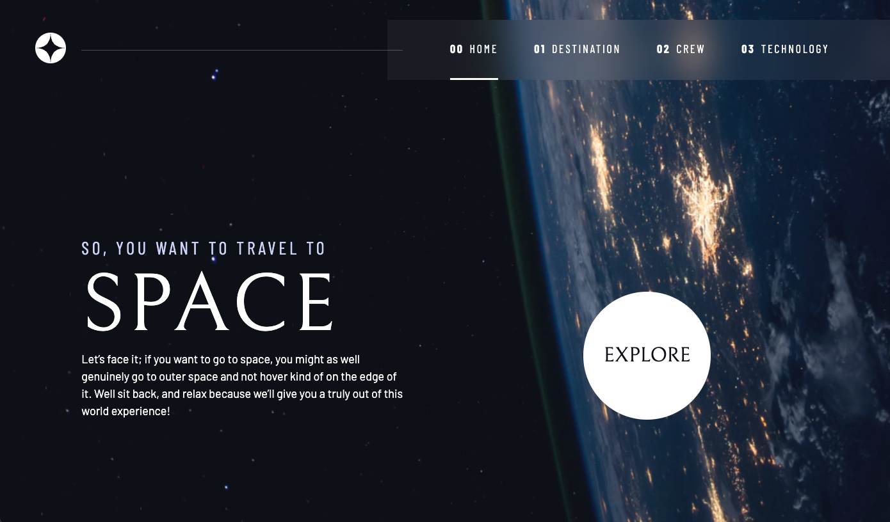

# Space Tourism Website

This is a solution to the [Space tourism website challenge on Frontend Mentor](https://www.frontendmentor.io/challenges/space-tourism-multipage-website-gRWj1URZ3). Frontend Mentor challenges help you improve your coding skills by building realistic projects.

## Table of contents

-   [Overview](#overview)
    -   [The challenge](#the-challenge)
    -   [Screenshot](#screenshot)
    -   [Links](#links)
-   [My process](#my-process)
    -   [Built with](#built-with)
    -   [What I learned](#what-i-learned)
    -   [Continued development](#continued-development)
    -   [Useful resources](#useful-resources)
-   [Author](#author)
-   [Acknowledgments](#acknowledgments)

## Overview

Using the provided images, design system, and tutorials, I created the Space Tourism website. The tutorials helped me build the Home, Destinations, and Crew pages. Using what I learned, I built the Technology page completely on my own.

The site uses only pure HTML, CSS and JavaScript to show my understanding of those languages.

The website includes all features needed for proper accessibility, including considerations for users with screen readers and users without a mouse.

### The Challenge

Users should be able to:

-   View the optimal layout for each of the website's pages depending on their device's screen size
-   See hover states for all interactive elements on the page
-   View each page and be able to toggle between the tabs to see new information

### Screenshot



### Links

-   Solution URL: [Add solution URL here](https://your-solution-url.com)
-   Live Site URL: [Add live site URL here](https://your-live-site-url.com)

## My Process

### Built with

-   Semantic HTML5 Markup
-   CSS Custom Properties
-   Flexbox
-   CSS Grid
-   Mobile-First Workflow
-   Vanilla JavaScript

### What I learned

Use this section to recap over some of your major learnings while working through this project. Writing these out and providing code samples of areas you want to highlight is a great way to reinforce your own knowledge.

To see how you can add code snippets, see below:

```html
<h1>Some HTML code I'm proud of</h1>
```

```css
.proud-of-this-css {
    color: papayawhip;
}
```

```js
const proudOfThisFunc = () => {
    console.log('🎉');
};
```

### Continued Development

Use this section to outline areas that you want to continue focusing on in future projects. These could be concepts you're still not completely comfortable with or techniques you found useful that you want to refine and perfect.

**Note: Delete this note and the content within this section and replace with your own plans for continued development.**

### Useful Resources

-   [Example resource 1](https://www.example.com) - This helped me for XYZ reason. I really liked this pattern and will use it going forward.
-   [Example resource 2](https://www.example.com) - This is an amazing article which helped me finally understand XYZ. I'd recommend it to anyone still learning this concept.

**Note: Delete this note and replace the list above with resources that helped you during the challenge. These could come in handy for anyone viewing your solution or for yourself when you look back on this project in the future.**

## Author

-   Website - [Add your name here](https://www.your-site.com)
-   Frontend Mentor - [@yourusername](https://www.frontendmentor.io/profile/yourusername)
-   Twitter - [@yourusername](https://www.twitter.com/yourusername)

**Note: Delete this note and add/remove/edit lines above based on what links you'd like to share.**

## Acknowledgments

This is where you can give a hat tip to anyone who helped you out on this project. Perhaps you worked in a team or got some inspiration from someone else's solution. This is the perfect place to give them some credit.

**Note: Delete this note and edit this section's content as necessary. If you completed this challenge by yourself, feel free to delete this section entirely.**
